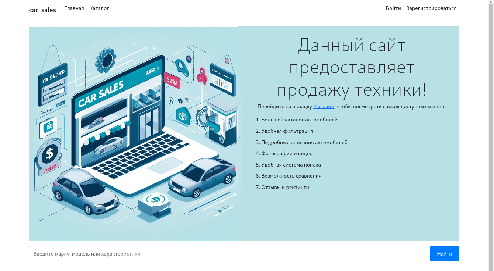
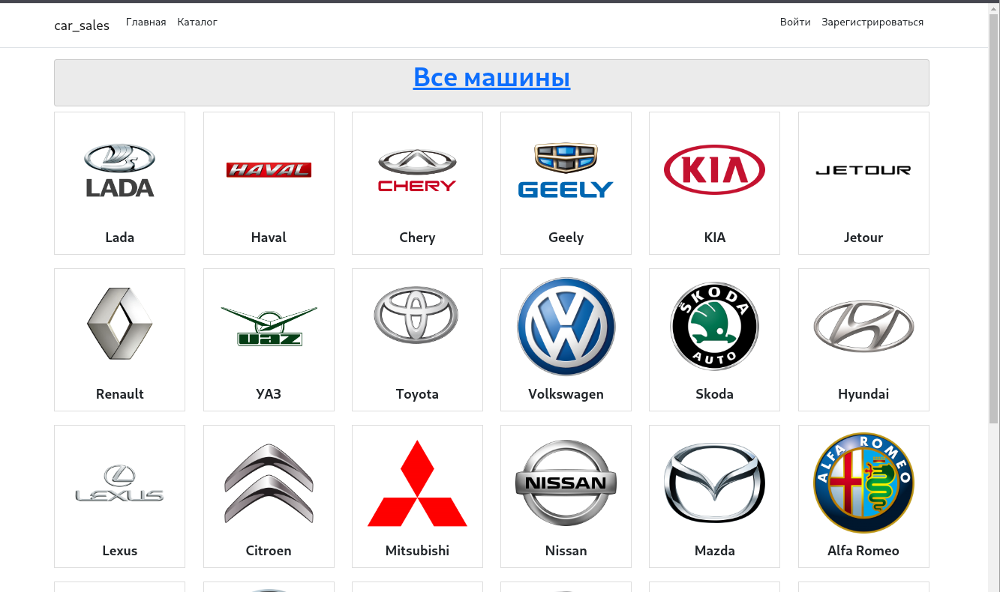
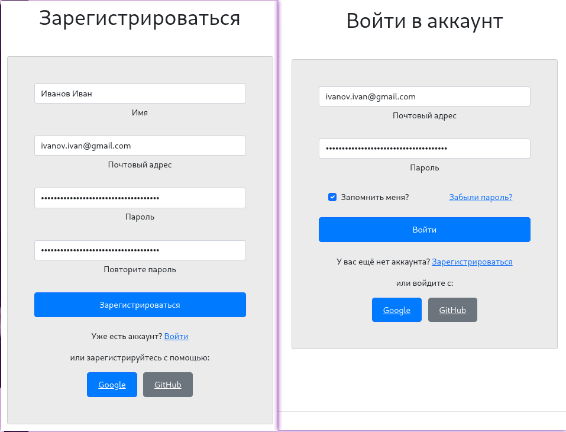

# Описание

Приложение на C# (ASP.NET), которое предоставляет отображение машин разный моделей, категорий и различные операции над ними от лица клиента и продавца.

Стек технологий: Net 7, ASP.NET 7, PostgreSQL, Docker, ...

## Превью

Главная страница

Страница каталога:

Страница списка автомобилей:

1

Страница регистрации и авторизации:

## Установка и использование

// TODO: Docker образ(ы), которые содержит всё приложение.

## План

1. Написать монолит с 5-10 доменными сущностями (интернет магазин, CRM система, или т.п.), желательно придерживаться Clean Architecture
2. Попилить на микросервисы
3. Обернуть в докер контейнеры
4. Реализовать пример оркестрации или хореографии
5. Реализовать пример асинхронного взаимодействия между сервисами
6. Подключить шину данных (Rabbit MQ)
7. Авторизация и аутентификация через единый микросервис авторизации (Identity Server C#)
